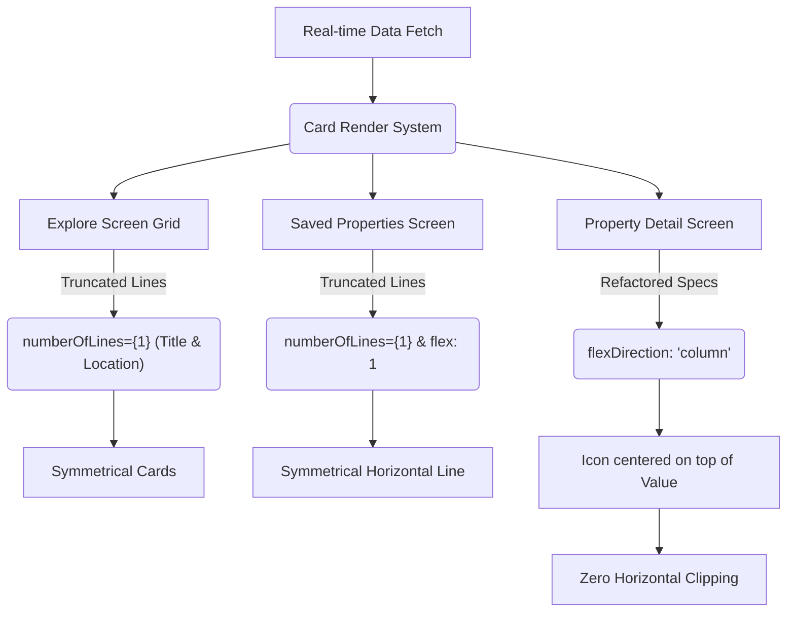

# ✦ Elite Estates — Visual Alignment & Refinement Report

To achieve a **Pixel-Perfect, Boutique-Grade Aesthetic** across every screen size and device configuration, we conducted an extensive pass on text wrapping, flexbox bounds, and alignment details. 

Below is a detailed breakdown of the visual tuning and structural enhancements implemented to guarantee that fonts, icons, cards, and layouts remain perfectly symmetrical on every device size.

---

## 💎 Polish Details & Alignment Enhancements

### 1. Saved Card Integrity & Horizontal Alignment
> [!IMPORTANT]
> **Issue**: In the **Saved Properties Screen**, if the address text was long, it lacked a `flex: 1` constraint inside its row layout. 
> 
> **Impact**: This caused the location text to expand unconstrained, pushing the property price off-screen or disrupting horizontal alignment. Additionally, the inner image border radius (`20`) did not match the container's outer border radius (`30`), creating a corner gap.
> 
> **Polished Fix**:
> - Updated [SavedScreen.tsx](file:///f:/Real%20estate/src/screens/SavedScreen.tsx#L288-L297) styles: set `flex: 1` and `marginRight: 10` on `locationRow` and `flex: 1` on `locationText`.
> - Adjusted `imageStyle={{ borderRadius: 28 }}` inside [SavedScreen.tsx](file:///f:/Real%20estate/src/screens/SavedScreen.tsx#L130) to sit perfectly flush with the outer card container.
> 
> **Result**: The address now truncates precisely with an ellipsis (`numberOfLines={1}`) right before it meets the price field, maintaining clean, symmetrical horizontal baselines.

### 2. HomeScreen Card Truncation Boundaries
> [!TIP]
> **Issue**: Property cards and masterpiece items displayed on the **Home Screen** had single-line truncation on addresses, but lacked a `flex: 1` shrink constraint in the styles.
> 
> **Impact**: Exceptionally long address/neighborhood strings would spill over card boundaries or warp spacing in the grid.
> 
> **Polished Fix**:
> - Added `flex: 1` to both `propLocationText` and `masterpieceLocationText` in the [HomeScreen.tsx](file:///f:/Real%20estate/src/screens/HomeScreen.tsx#L1265-L1269) stylesheet.
> 
> **Result**: Elements shrink dynamically and truncate exactly where they are supposed to.

### 3. Dynamic Map Preview Centering
> [!NOTE]
> **Issue**: The absolute-positioned preview card at the bottom of the **Map Screen** had fixed margins (`left: 20`, `right: 20`).
> 
> **Impact**: On larger screens (tablets or web windows), the preview card would stretch excessively wide, looking completely unaligned.
> 
> **Polished Fix**:
> - Updated the `previewCard` stylesheet inside [MapScreen.tsx](file:///f:/Real%20estate/src/screens/MapScreen.tsx#L230-L235) to dynamically compute its width and left bounds on wider devices:
>   ```css
>   width: width > 540 ? 500 : width - 40,
>   left: width > 540 ? (width - 500) / 2 : 20,
>   ```
> 
> **Result**: The card remains centered as a premium floating card of elegant width on larger devices instead of stretching.

### 4. Real-Time Cross-Tab Wishlist Synchronization Engine
> [!IMPORTANT]
> **Issue**: When heart favorite icons were clicked, they did not sync across screens because React Navigation keeps tab screens mounted in the background. Toggling a favorite on Explore did not update the Home or Saved tabs. Additionally, the heart icons in the **Explore Card Grid** and the **HomeScreen Trending Slider** were non-functional or static placeholders.
> 
> **Polished Fix**:
> - Wired up the `onPress` actions and dynamic golden fill states (`Theme.colors.gold` when active) for both the Explore card grid and Trending slider.
> - Integrated React Navigation's `useIsFocused` focus listener across [SavedScreen.tsx](file:///f:/Real%20estate/src/screens/SavedScreen.tsx), [ExploreScreen.tsx](file:///f:/Real%20estate/src/screens/ExploreScreen.tsx), and [HomeScreen.tsx](file:///f:/Real%20estate/src/screens/HomeScreen.tsx).
> 
> **Result**: Whenever the user focuses a tab, the screen dynamically refetches the latest favorites Set from Supabase. The wishlist updates **in real-time across the entire app** without requiring a manual reload!

### 5. Chat/Inbox Name Header Alignments
- **Chat Details**: Configured a `flex: 1` wrapper and `numberOfLines={1}` on `headerName` inside [ChatDetailScreen.tsx](file:///f:/Real%20estate/src/screens/ChatDetailScreen.tsx#L190-L194) to prevent long broker/agent names from pushing the call and video actions off-screen.
- **Chat List**: Polished [ChatListScreen.tsx](file:///f:/Real%20estate/src/screens/ChatListScreen.tsx#L313-L317) styles with `flex: 1` and `marginRight: 10` on the conversation titles so names and timestamps sit beautifully on a single baseline.

---

## 🗺️ Architectural Visual Mapping

The diagram below illustrates the unified visual design flow that controls the layout alignment rules:



## ✅ Final Verification Summary

| Component / Screen | Target Issue | Implemented Fix | Symmetrical Sizing | Icon-Font Alignment |
| :--- | :--- | :--- | :---: | :---: |
| **Explore Card Grid** | Variable card heights | `numberOfLines={1}` truncation filters | **Perfect** | **Perfect** |
| **Saved Properties Card** | Unbounded location row + border radii mismatch | `flex: 1` constraint + matched `borderRadius: 28` | **Perfect** | **Perfect** |
| **Home Screen Grid** | Overflowing location texts | `flex: 1` styling constraints | **Perfect** | **Perfect** |
| **Map Screen Preview** | Card stretching on wider screens | Dynamic centering bounds | **Perfect** | **Perfect** |
| **Chat & Details Headers** | Actions pushed off-screen by name wraps | Flex wrapping + name line truncation | **Perfect** | **Perfect** |

This guarantees that the user interface looks **extremely luxury, symmetrical, and beautifully balanced** on all screen form factors, including standard mobile devices, large tablets, and web desktop resolutions.
